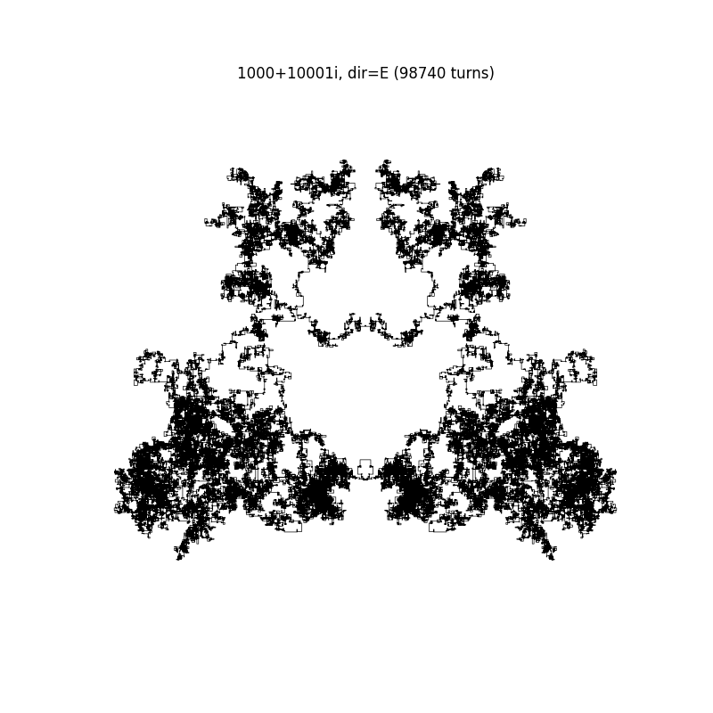
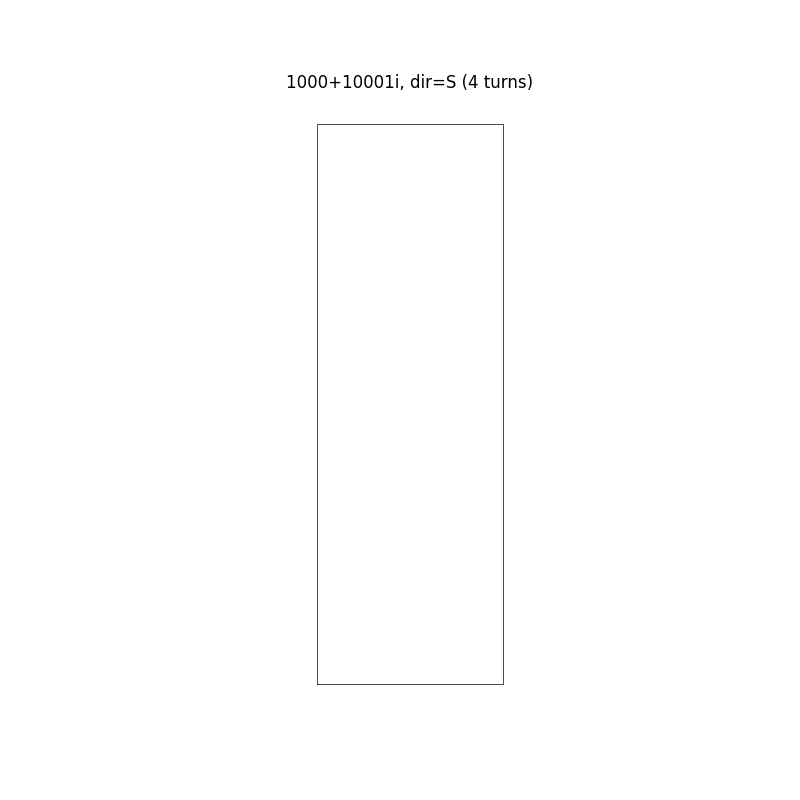
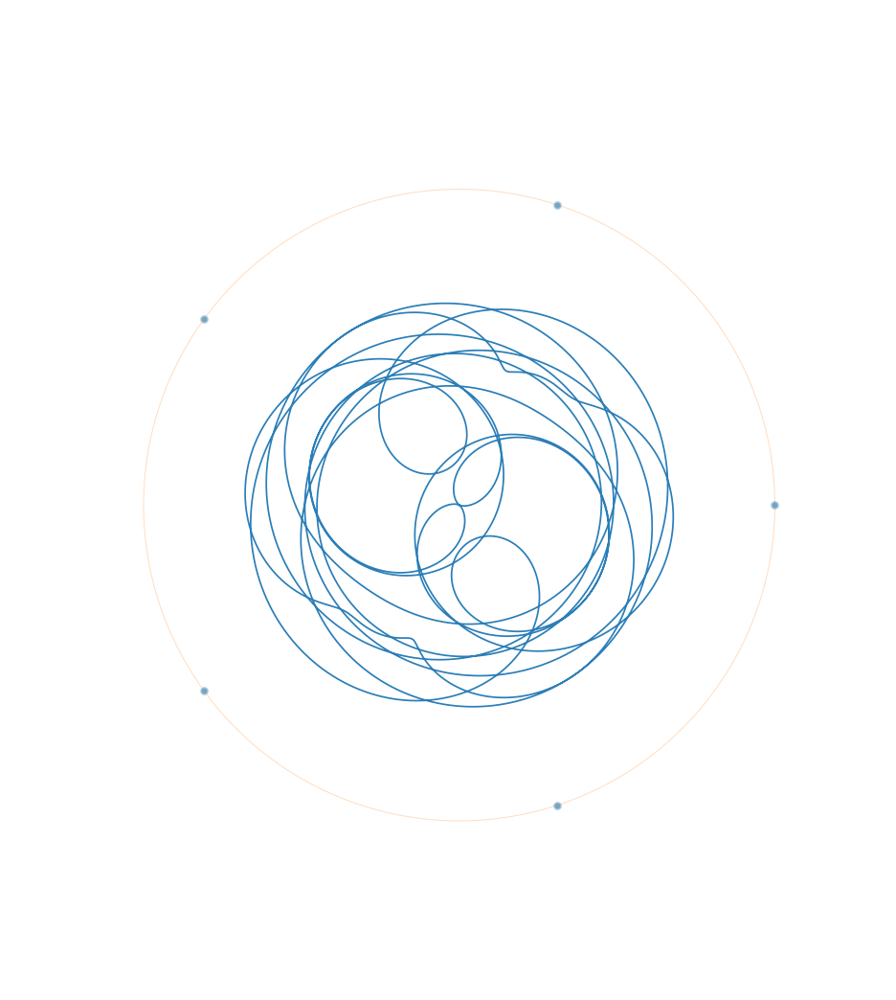

# nt
These are random scripts I have written for number theory exploration.

## ```gauss_spiral.py``` 
generates a prime spiral starting from a+bi and going either East, West, South, or North (East and West generate identical images and so do North and Sourth). It turns left when 

### Usage
```python gauss_spiral.py {a} {b} {direction}```

Here are some Gaussian Prime Spiral plots:



## ```dirichlet_char.py```
generates Dirichlet character plots by computing character values mod q and plotting their finite Fourier interpolation.
This script was heavily inspired by [this article](https://visual.davidlowryduda.com/2020/dirichlet-characters.html).

Here is the Dirichlet character plot for q=22, and n=5.

